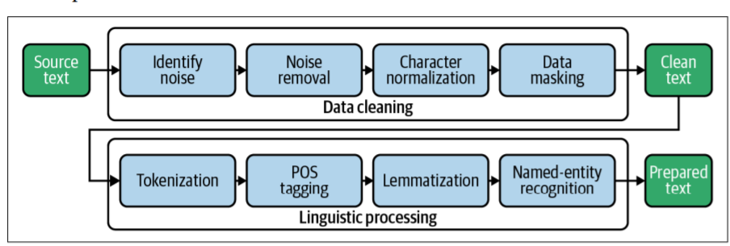

# Preparing Textual Data for Statistics and Machine Learning

## Data Preprocessing Pipeline

The first major block of operations in our pipeline is data cleaning. We start by identi‐
fying and removing noise in text like HTML tags and nonprintable characters. Dur‐
ing character normalization, special characters such as accents and hyphens are
transformed into a standard representation. Finally, we can mask or remove identifi‐
ers like URLs or email addresses if they are not relevant for the analysis or if there are
privacy issues. Now the text is clean enough to start linguistic processing.

Here, tokenization splits a document into a list of separate tokens like words and
punctuation characters. Part-of-speech (POS) tagging is the process of determining the
word class, whether it’s a noun, a verb, an article, etc. Lemmatization maps inflected
words to their uninflected root, the lemma (e.g., “are” → “be”). The target of namedentity recognition is the identification of references to people, organizations, locations,
etc., in the text.

---

## Cleaning Text

* Special formatting and program code

The text may still contain special characters, HTML entities, Markdown tags, and
things like that. These artifacts should be cleaned in advance because they com‐
plicate tokenization and introduce noise.

* Salutations, signatures, addresses, etc.

Personal communication often contains meaningless polite phrases and saluta‐
tions by name that are usually irrelevant for the analysis.

* Replies

If your text contains answers repeating the question text, you need to delete the
duplicate questions. Keeping them will distort any model and statistics.

---

